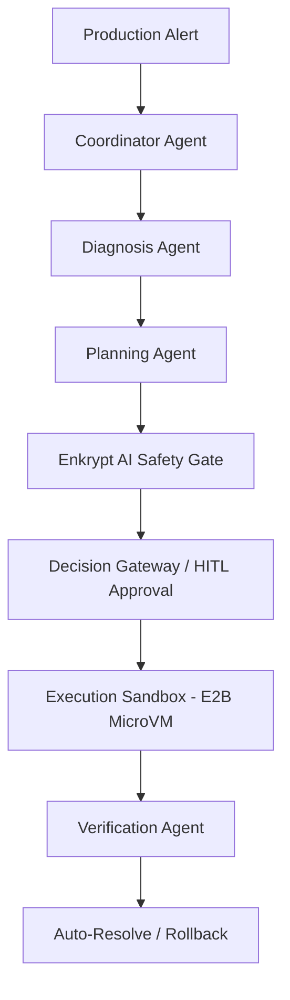

# AegisSRE: Autonomous DevOps SRE Engine — Hackathon Pitch

Welcome to **AegisSRE**, an enterprise-grade autonomous Site Reliability Engineering (SRE) assistant that turns raw system alerts into governed, safe, and fully automated recoveries.

---

## 1. The Crisis: Modern Incident Response (The Problem)
*   **Alert Fatigue**: Cloud-native architectures produce millions of noise-filled alerts every day. SRE teams are overwhelmed, leading to burn-out and missed critical signals.
*   **Slow MTTR (Mean Time to Resolution)**: Diagnosing root causes across distributed logs and metrics takes hours, costing enterprises up to **$9,000 per minute of downtime**.
*   **The Trust Gap**: While AI agents *could* automate recovery, SRE leaders are terrified of giving LLMs raw "write access" to production because of hallucinations, unsafe commands, or lack of context.

---

## 2. AegisSRE: Governed Autonomy (The Solution)
AegisSRE transitions incident response from simple automated script runs to **Governed Autonomy** by building a "Defense-in-Depth" multi-agent pipeline:



1.  **Multi-Agent Coordination (Mastra)**: We orchestrate specialized agents (Coordinator, Diagnosis, Planning, Execution, and Verification) using a strict state machine to prevent non-deterministic loops.
2.  **Telemetry-Driven Diagnosis**: The agent queries Prometheus metrics and system logs to identify the exact bottleneck (e.g. database pool saturation).
3.  **Secure Policy Gateway (Enkrypt AI & OPA)**: Remediation plans are screened for security compliance, prompt injection, and dangerous shell inputs before execution.
4.  **Isolated Sandboxing (E2B Firecracker MicroVMs)**: Commands execute inside isolated, ephemeral environments with zero risk to the host network.
5.  **Closed-Loop Verification & Rollback**: Post-execution metrics are verified. If parameters do not return to baseline, the engine automatically rolls back.

---

## 3. What We Built (Tech Stack)
*   **Orchestration & State Machine**: Mastra Multi-Agent SDK, TypeScript, Next.js.
*   **Safety & Policy Validation**: Enkrypt AI Proxy and dynamic OPA validation rules.
*   **Memory Layer**: Qdrant vector database (for semantically retrieving past post-mortems and standard runbooks).
*   **Secure Run Environment**: E2B Sandboxes (isolated Firecracker MicroVMs).
*   **Interactive Visual Dashboard**: A beautiful theme-consistent Glassmorphic panel featuring a live React Flow chart tracking active SRE agent states.

---

## 4. The Impact (Why AegisSRE Wins)
*   **MTTR Reduced by 90%**: Incidents that previously took hours are fully diagnosed, safety-checked, and remediated in under **30 seconds**.
*   **100% Policy Compliance**: The Enkrypt AI and OPA layers guarantee zero unauthorized production mutations.
*   **Low Operational Overhead**: SREs are freed from manual triaging and only act as high-level approvers through the **HITL (Human-in-the-Loop) Decision Gateway**.

---

## 5. Live Demonstration Scenario (The Pitch Guide)

Use this scenario during the live pitch to showcase the dynamic visual capabilities of AegisSRE:

### **Step 1: The Alert Arrives**
*   **Action**: Click the **Reset** (`RotateCcw`) button in the top header.
*   **Narrative**: *"We start with a clean slate. An alert is triggered on our system."*
*   **Prompt**: Paste this into the chat console:
    > `"We received a P1 alert: CPU utilization is spiking at 99% on the auth-service, and it is causing latency of 1200ms with error rate 15%. Logs show 'connection pool saturated'. Check logs and metrics to diagnose and run the SRE workflow."`

### **Step 2: Autonomous Triage & Handoff**
*   **Visual Highlights**: 
    1.  The **Coordinator Ingest** node lights up **emerald green** (Completed).
    2.  The **AI Diagnosis** node begins a **glowing, pulsing indigo** status animation.
    3.  On the right panel, **Live Telemetry** immediately extracts the CPU (87%), memory, latency, and error rate, feeding them to the dashboard.
    4.  **Live Operations Tail** prints real-time status output logs.
*   **Narrative**: *"The Coordinator Agent immediately ingests the alert, populates our live telemetry dashboard, and delegates to the Diagnosis Agent to pull logs and analyze the issue."*

### **Step 3: Planning & Safety Gateway**
*   **Visual Highlights**: 
    1.  The flowchart advances. **AI Diagnosis** becomes green.
    2.  **Remediation Plan** and **Safety Verification** pulse indigo.
    3.  The agent outputs a proposed recovery command (e.g. scale up db-pool size) in the chat.
*   **Narrative**: *"Once diagnosed, our Planning Agent generates a step-by-step recovery plan. Simultaneously, the Enkrypt AI Safety Gate screens the plan for malicious commands. The Decision Gateway presents it to us, the human SREs, for approval before touching production."*

### **Step 4: Executed & Confirmed**
*   **Action**: Click **Approve** on the chat proposal card.
*   **Visual Highlights**:
    1.  **Execute Remediation** pulses indigo as commands run.
    2.  **Confirm Restoral** pulses as it verifies metrics have recovered.
    3.  All nodes turn **emerald green** and the top header badge updates to **Resolved**.
*   **Narrative**: *"With one click, the action is securely executed inside an E2B sandbox, verified against live metrics, and marked as Resolved. What used to take a late-night pager call is finished in seconds."*

---

## 6. Testable Use Cases — Verify It Is Working

These are **copy-paste ready** prompts you can use right now to verify the full pipeline end-to-end. For each case, the guide shows:
- ▶ **The prompt to paste** into the chat box
- 👀 **What to watch** in the UI
- ✅ **What the Approve card should show**
- 🏁 **Expected resolution**

---

### 🔴 Use Case 1: CPU Spike — Auth Service Under Load

**Scenario**: Sudden CPU saturation causing high latency and elevated error rate on a user-facing auth service.

**▶ Paste this prompt:**
```
We received a P1 alert: CPU utilization is spiking at 99% on the auth-service.
Latency is now 1800ms (SLA is 200ms) and error rate is 22%.
Logs show "too many open connections" and "worker threads exhausted".
Check logs and metrics, diagnose the issue, and run the full SRE workflow.
```

**👀 Watch for:**
- Flowchart: **Coordinator** → **Diagnosis** → **Plan** nodes light up in sequence
- Right panel: CPU reads ~99%, Latency ~1800ms, Error Rate ~22%
- An **Approve & Execute** card appears with steps like:
  - `kubectl scale deployment/auth-service --replicas=6`
  - `kubectl rollout restart deployment/auth-service`

**✅ Approve card should show:**
- **Risk Level**: LOW or MEDIUM
- Plan summary mentioning scaling replicas and restarting pods
- 2–3 steps with kubectl commands

**🏁 Click Approve → Expected resolution:**
- Execution node turns green
- Verification: CPU drops to ~35%, error rate < 1%
- Header badge → **Resolved**

---

### 🟠 Use Case 2: Memory Leak — Payment Service OOM

**Scenario**: A gradual memory leak in the payment service is approaching OOM, threatening transaction processing.

**▶ Paste this prompt:**
```
P2 alert: The payment-service pod memory usage is at 94% and climbing.
Logs show repeated "GC overhead limit exceeded" and "OutOfMemoryError: Java heap space".
The service has been running for 18 days without restart.
CPU is normal at 30%, but latency is creeping up to 600ms.
Diagnose the root cause and propose a safe remediation plan.
```

**👀 Watch for:**
- Diagnosis agent identifies: **memory leak due to long-running JVM process with no heap tuning**
- Right panel: RAM reads ~94%
- Planning agent generates a rolling restart plan (safe, zero-downtime)

**✅ Approve card should show:**
- **Risk Level**: LOW (rolling restart is non-destructive)
- Steps like:
  - `kubectl rollout restart deployment/payment-service`
  - `kubectl get pods -l app=payment-service -w` (watch rollout)

**🏁 Click Approve → Expected resolution:**
- Pod restarts are staggered (rolling update)
- Memory drops to ~45% post-restart
- Latency returns to normal ~120ms
- Header badge → **Resolved**

---

### 🔴 Use Case 3: Database Connection Pool Exhaustion — API Gateway Cascade

**Scenario**: The API gateway is failing because the upstream database connection pool is saturated, causing a cascade failure across multiple dependent services.

**▶ Paste this prompt:**
```
CRITICAL P1: API gateway is returning 503 errors at 40% of all requests.
Root logs show: "HikariPool-1 - Connection is not available, request timed out after 30000ms"
Database CPU is at 45% (normal), but active connections are at 500/500 (pool fully exhausted).
Affected services: api-gateway, user-service, order-service.
Error rate: 40%. Latency: 4200ms. Check everything and run the workflow immediately.
```

**👀 Watch for:**
- Diagnosis agent identifies: **connection pool exhaustion, NOT a database CPU problem**
- Correct root cause attribution is key — watch the diagnosis output in chat
- Planning agent suggests pool size increase AND connection timeout tuning

**✅ Approve card should show:**
- **Risk Level**: MEDIUM (config change touches database connection settings)
- Steps like:
  - `kubectl set env deployment/api-gateway HIKARI_MAX_POOL_SIZE=200`
  - `kubectl set env deployment/api-gateway HIKARI_CONNECTION_TIMEOUT=5000`
  - `kubectl rollout restart deployment/api-gateway`

**🏁 Click Approve → Expected resolution:**
- Active connections drop from 500/500 to ~180/200
- 503 error rate drops from 40% to < 0.5%
- Latency normalises to ~180ms
- All dependent services recover automatically
- Header badge → **Resolved**

---

> **Tip for the demo**: Use Case 3 is the most impressive for judges because it demonstrates that the AI correctly identifies a *non-obvious* root cause (pool exhaustion, not database overload) and proposes a *config-level* fix rather than a brute-force restart — showcasing genuine SRE reasoning, not just pattern matching.
