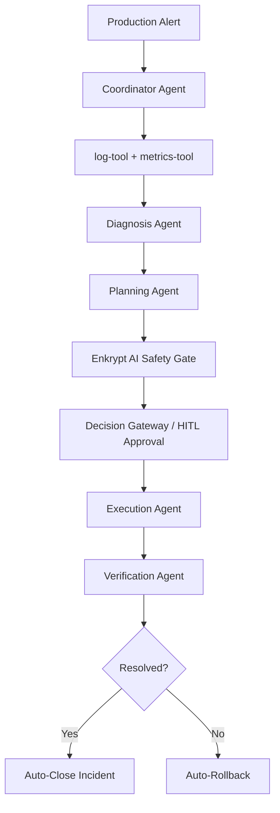

# AegisSRE — Autonomous DevOps SRE Engine

<div align="center">


**An enterprise-grade, governed autonomous system that ingests production alerts, diagnoses root causes, and executes remediations within a high-security, human-in-the-loop framework.**

</div>

---

## 🚨 The Problem

Modern cloud-native environments generate millions of noisy alerts every day, leading to:

- **Alert Fatigue** — SRE teams are overwhelmed, leading to burnout and missed critical signals.
- **Slow MTTR** — Diagnosing root causes across distributed logs and metrics costs enterprises up to **$9,000 per minute of downtime**.
- **The Trust Gap** — Organizations are hesitant to grant AI "write access" to production due to hallucinations, unsafe commands, and lack of context.

---

## ✅ The Solution: Governed Autonomy

AegisSRE transitions incident response from simple automation to **Governed Autonomy** — providing the speed of AI while ensuring humans retain ultimate authority through a centralized **Decision Gateway** and a robust safety layer.



---

## 🏗️ Architecture

The system is organized into **six functional layers**:

| Layer | Components |
|---|---|
| **Ingestion & Messaging Mesh** | API Gateway (Kong), Event Mesh (NATS/Kafka), PagerDuty/Sentry |
| **Mastra Multi-Agent Core** | Coordinator, Diagnosis, Planning, Execution, Verification Agents |
| **Governance & Decision Gateway** | Enkrypt AI Proxy, OPA Policy Engine, HITL Approval |
| **Secure Execution Layer** | E2B Sandboxes (Firecracker MicroVMs) |
| **Persistence & Secrets** | Qdrant (Vector Memory), LibSQL (State), HashiCorp Vault |
| **Observability Stack** | OpenTelemetry, Prometheus, Grafana, Jaeger |

---

## 🤖 Multi-Agent Pipeline

| Agent | Responsibility |
|---|---|
| **Coordinator Agent** | Main entry point. Ingests alerts, delegates to specialist agents. |
| **Diagnosis Agent** | Correlates logs & metrics to identify root cause and severity. |
| **Planning Agent** | Generates a remediation DAG. Validates against Enkrypt AI policy. |
| **Execution Agent** | Executes approved commands in E2B isolated sandbox. |
| **Verification Agent** | Monitors post-execution telemetry to confirm recovery. |

---

## 🛡️ Safety & Governance

The **Defense-in-Depth** pipeline ensures zero unauthorized production mutations:

```
Planning Agent → Enkrypt AI Proxy → OPA Policy Check → Decision Gateway → HITL Approval → E2B Sandbox
```

- **Enkrypt AI Proxy** — Screens remediation plans for prompt injection and dangerous commands.
- **OPA (Open Policy Agent)** — GitOps-synced policy rules evaluated before every execution.
- **Decision Gateway** — Risk-based routing: Low → Autonomous, Medium → Slack Approval, High → Senior SRE, Critical → Block.
- **Emergency Kill Switch** — Instantly halts all Mastra workflows and revokes sandbox credentials.

---

## 🖥️ Dashboard Features

- **Live Flowchart** — React Flow canvas visualizing active agent states in real-time (Coordinator → Diagnosis → Plan → Execute → Verify).
- **Live Telemetry** — CPU, RAM, Error Rate, and Latency dashboards updated from tool outputs.
- **Incident Pipeline Stepper** — RUNNING / PENDING / COMPLETED states per workflow step.
- **Live Operations Tail** — Real-time log stream from the affected service.
- **Reset Chat** — One-click button to clear thread memory, reset incident state, and start fresh.
- **Dark / Light Theme** — Glassmorphic premium UI with full theme toggle support.

---

## ⚡ Tech Stack

| Category | Technology |
|---|---|
| **Framework** | Next.js 16 (Turbopack), TypeScript |
| **Multi-Agent Orchestration** | Mastra SDK |
| **LLM Providers** | OpenAI GPT-4o-mini / Google Gemini 2.5 Flash |
| **AI Safety** | Enkrypt AI Proxy, OPA |
| **Vector Memory** | Qdrant |
| **Execution Sandbox** | E2B (Firecracker MicroVMs) |
| **Messaging** | NATS, Kafka (with DLQ) |
| **Observability** | OpenTelemetry, Prometheus, Grafana, Jaeger |
| **Secrets Management** | HashiCorp Vault |

---

## 🚀 Getting Started

### Prerequisites

- Node.js 18+
- An OpenAI or Google Gemini API key

### Installation

```bash
git clone https://github.com/ghoshvidip26/AegisSRE-MastraAI.git
cd AegisSRE-MastraAI
npm install
```

### Environment Setup

Copy `.env.example` to `.env` and fill in your credentials:

```env
OPENAI_API_KEY=sk-...         # Optional: falls back to Gemini if not set
GOOGLE_GENERATIVE_AI_API_KEY= # Required if OPENAI_API_KEY is not set
```

### Run Development Server

```bash
npm run dev
```

Open [http://localhost:3000](http://localhost:3000) in your browser.

---

## 🧪 Testing the Demo

1. **Start Fresh** — Click the **Reset** (`↺`) button in the top header to clear all state.
2. **Trigger an Incident** — Paste this into the chat:
   > *"I received a P1 alert: CPU utilization is spiking at 99% on the auth-service, latency is 1200ms, error rate is 15%. Logs show 'connection pool saturated'. Check logs and metrics to diagnose and run the workflow."*
3. **Watch the Pipeline** — The flowchart nodes will light up in sequence as agents hand off work.
4. **Live Telemetry** — CPU, RAM, Latency, and Error Rate populate automatically from tool outputs.
5. **Approve the Remediation** — Review the proposed recovery steps and click Approve.
6. **See Resolution** — All nodes turn green and the header shows **Resolved**.

---

## 📋 Human Approval Matrix

| Operation | Risk | Autonomous | HITL Required |
|---|---|---|---|
| Read Logs / Metrics | Low | ✅ Yes | ❌ No |
| Search Memory | Low | ✅ Yes | ❌ No |
| Restart K8s Pod | Medium | ❌ No | ✅ Slack Approval |
| Rollback Deployment | High | ❌ No | ✅ Senior SRE |
| DB Migration | Critical | ❌ No | 🔴 Blocked |
| Resource Deletion | Critical | ❌ No | 🔴 Blocked |

---

## 📈 Impact

| Metric | Target |
|---|---|
| MTTR Reduction | **50–90%** |
| Safety Compliance | **0 unauthorized mutations** |
| HITL Efficiency | High % of plans approved without modification |
| Alert Response Time | **< 30 seconds** end-to-end |

---

## 📂 Project Structure

```
AegisSRE-MastraAI/
├── app/
│   ├── api/
│   │   ├── chat/          # Chat stream endpoint + Reset endpoint
│   │   └── incidents/     # Incident CRUD + Mastra workflow trigger
│   ├── layout.tsx         # Root layout with suppressed hydration
│   └── page.tsx           # Main dashboard with IncidentHeader + WorkflowCanvas
├── components/
│   ├── dashboard/
│   │   ├── incident-context.tsx  # Real-time tool output parser + context provider
│   │   ├── sidebar.tsx           # System health + incident list
│   │   ├── workflow-canvas.tsx   # React Flow pipeline visualization
│   │   └── context-panel.tsx     # Telemetry + logs right panel
│   └── ai-elements/              # Chat message UI components
├── src/
│   ├── agents/            # 5 Mastra agents (coordinator, diagnosis, planning, execution, verification)
│   ├── tools/             # log-tool, metrics-tool, delegation tools
│   ├── mastra/            # Mastra init + Enkrypt AI policy tool
│   ├── prompts/           # CRISPE-framework agent prompts
│   └── workflows/         # Incident state machine workflow
├── lib/
│   └── incidents/         # In-memory incident store with CRUD + clear
├── docs/
│   ├── CRISPE_PROMPTS.md
│   ├── IEEE830_REQUIREMENTS.md
│   └── OWASP_SECURITY_SPECS.md
├── PRD.md                 # Full Product Requirements Document
└── PITCH.md               # Hackathon pitch deck + live demo guide
```

---

## 📄 License

MIT © AegisSRE Team
